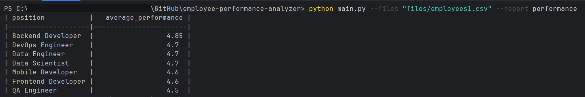
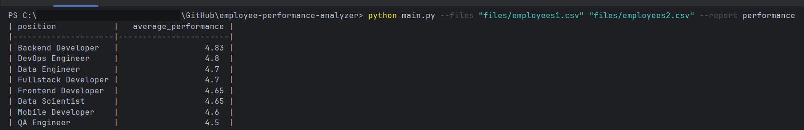
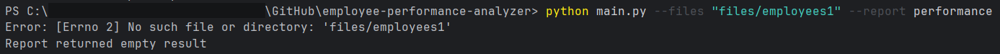
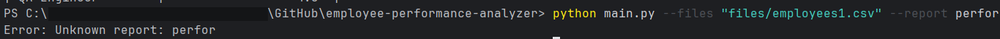

# Анализ эффективности работы сотрудников

Программа позволяет формировать отчет эффективности работы сотрудников различных отделов, показывает результаты в удобной таблице и располагает данные по убыванию коэффициента эффективности.  
Имеет возможность расширения.

---

## Запуск программы

Для запуска программы в консоли нужно:

1. Перейти в корневую папку проекта.
2. Ввести команду:

```bash
python main.py --files [путь к вашим файлам через пробел] --report [вид отчета]
```

Сейчас доступен только отчет об эффективности(--report performance).

---

## Добавление нового вида отчетов

Если есть необходимость добавить дополнительный вид отчетов, нужно:

1. Создать класс этого отчета в папке `src/reports`.
2. Унаследовать его от `BaseReport`.
3. Добавить в список аргументов в `report_engine.py` (словарь — простое решение для небольшого проекта).

---

## Скриншоты работы программы

### Пример запуска одного файла


### Пример запуска с несколькими файлами


### Результат работы тестов и отображение уровня покрытия


### Обработка введения имени несуществующего файла


### Обработка введения несуществующего вида отчетов

